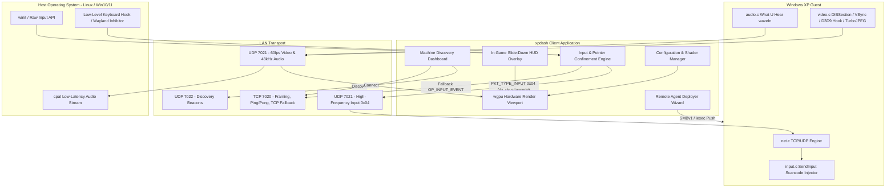

# xpdash UI & Client Architecture Roadmap

This document specifies the complete architectural design, engineering roadmap, and multi-session implementation plan for the **xpdash user-facing ecosystem**: the polished cross-platform client GUI, input confinement and modifier routing subsystem, retro visual shaders, and zero-touch remote/manual deployment packaging.

---

## 1. Executive Vision & Core User Experience

### 1.1 The Remote Retro Gaming Challenge
Playing 3D Windows XP titles over LAN poses unique human-interface challenges that standard remote desktop tools (RDP, VNC, AnyDesk) fail to address:
1. **Unconfined Mouse Trapping**: 3D games (FPS, action, flight simulators) use relative mouse deltas to rotate the camera. In standard remote desktop, the host cursor hits the window edge or second monitor and stops, halting player movement.
2. **Host vs. Guest Key Hijacking**: Pressing `Alt+Tab`, `Super / Windows`, or `Alt+F4` switches host applications rather than interacting with the retro guest.
3. **Aspect Ratio & Display Distortion**: Running classic 4:3 resolutions (640×480, 800×600, 1024×768) on modern 16:9 or 21:9 monitors often produces blurry scaling or unnatural widescreen stretching.
4. **Friction in Deployment**: Non-technical users need a zero-friction path: discover rigs automatically, push updates remotely, or double-click a single standalone installer on Windows XP.

### 1.2 Design Principles
- **Instant Immersion**: Open client, see auto-discovered machines, click Connect, and play with hardware DirectSound3D/EAX audio and 60 fps low-latency video.
- **Explicit Host/Guest Boundary**: Visual indicators (amber border glow, toast HUD) clearly state whether the keyboard and mouse are captured by the retro guest or released to the host.
- **Native Efficiency**: Built with Rust (`egui` + `wgpu`) for lightweight CPU overhead (< 2%), sub-millisecond frame submission, and zero Electron/Chromium baggage.
- **Authentic Retro Aesthetics**: Optional GPU-accelerated CRT scanlines, aperture grille mask, and pixel-perfect integer scaling preserving period aesthetics.

---

## 2. System Architecture & UI State Flow



---

## 3. UI Component Specifications

### 3.1 Machine Discovery Dashboard
The launch screen when opening `xpdash`:
- **Auto-Discovery Grid**:
  - Displays LAN rigs found via UDP 7022 beacons within 500ms.
  - Cards show: Hostname (`TIMEMACHINE-XP`), IP (`10.0.10.113`), OS badge (`Windows XP SP3`), Resolution (`800x600`), and Audio Hardware (`Creative SB0090 Audigy EMU10K2 - EAX 3.0`).
  - Real-time RTT latency badge: Green (`< 5ms`), Yellow (`5-20ms`), Red (`> 20ms`).
  - Security fingerprint status: Green shield for verified/trusted server, amber warning for new fingerprints.
  - Thumbnail snapshot preview updated every 5 seconds.
- **Manual Connect Bar**:
  - Quick-connect input for explicit IP:port entry (for cross-subnet or VPN use).
- **Global Actions**:
  - "Deploy Agent to XP Box" button launching the Remote Deployment Wizard.
  - Client Settings & Shader Preferences.

### 3.2 In-Game Viewport & Low-Latency Renderer
- **Hardware wgpu Surface**:
  - Zero-copy texture streaming: direct upload of decompressed LZ4 BGRA frames into GPU textures (`wgpu::TextureFormat::Bgra8UnormSrgb`).
  - Vertex/Fragment pipeline executing retro CRT shaders with negligible GPU load (< 1% on GTX 1060+).
- **Aspect Ratio & Scaling Options**:
  - `Fit 4:3 (Pillared)`: Preserves period aspect ratio with clean black side pillars on modern monitors.
  - `Integer Scale (1x/2x/3x)`: Pixel-perfect nearest-neighbor scaling for authentic CRT crispness.
  - `Bilinear Stretch`: Smooth edge interpolation for non-integer resolutions.
  - `CRT Scanline Shader`: Configurable scanline intensity (0–100%), aperture grille shadow mask, and slight barrel curvature simulating a Sony Trinitron CRT.

### 3.3 Slide-Down In-Game HUD
Activated by hovering the top 16 pixels of the window or pressing `F10`:
- **Live Stream Diagnostics Bar**:
  - Real-time glass-to-glass latency estimate ($RTT / 2 + 10\text{ms}$).
  - Current Video FPS (e.g. `60.0 FPS`), compression ratio, and instantaneous bitrate (`Mbps`).
  - Audio jitter buffer health (e.g. `10ms buffer, 0 underruns, ±1.2ms jitter`).
- **Quick Action Controls**:
  - `Pointer Lock Toggle`: Visual switch (`Confined [F12]`, release via `Escape`).
  - `Audio Volume Slider`: 0% to 150% boost with Mute toggle.
  - `Mouse Sensitivity Slider`: Fine-tune cursor sensitivity (0.1x to 3.0x).
  - `Aspect Ratio Selector`: Fit 4:3 (Pillared), Integer 1x, Integer 2x, Bilinear Stretch.
  - `OBS 1x Mode Toggle`: `F9` toggle for virtual capture card mode with 1:1 window sizing.
  - `Send Ctrl+Alt+Del`: Dedicated one-click trigger sending the security attention sequence to XP.
  - `Display Mode`: Quick toggle between Fullscreen (`F11`), Borderless, and Windowed.
  - `Disconnect`: Clean TCP session termination returning to discovery dashboard.

### 4.2 Granular Modifier Interception Matrix
| Mode | Trigger | Mouse Behavior | Coordinate System | Intended Use |
|---|---|---|---|---|
| **Desktop / Unconfined** | Default; toggled via `F12` or `Escape` | Host cursor visible; moves freely across host desktop and window borders. | Absolute screen coordinates mapped to XP desktop ($0..65535$). | Menus, file management, launcher tools, strategy games. |
| **Game / Confined (Locked)** | Click inside window or press `F12` | Host cursor grabbed and hidden (`CursorGrabMode::Locked`). Window borders glow amber. | Raw relative hardware motion deltas ($\Delta X, \Delta Y$) via `Event::DeviceEvent` and `Event::MouseMoved`. | 3D games (FPS, flight sims, racing) requiring continuous camera rotation (e.g. GTA San Andreas). |

- **Confinement Release Hotkey**:
  - Default: **`Escape`** or **`F12`**.
  - Visual indicator: Subtle 2-pixel ambient border around the viewport (cyan = released, amber = captured).
  - Windows Cursor Lock Compatibility: Handles both raw `DeviceEvent` and `Event::MouseMoved` delta tracking when host OS confines cursor within window bounds.

```rust
// PS/2 Set 1 Scancodes for legacy DirectX games
pub fn keycode_to_ps2_scancode(key: KeyCode) -> (u16, bool) {
    match key {
        KeyCode::KeyW => (0x11, false),
        KeyCode::KeyA => (0x1E, false),
        KeyCode::KeyS => (0x1F, false),
        KeyCode::KeyD => (0x20, false),
        KeyCode::Space => (0x39, false),
        KeyCode::Enter => (0x1C, false),
        KeyCode::Escape => (0x01, false),
        KeyCode::Tab => (0x0F, false),
        KeyCode::LeftShift => (0x2A, false),
        KeyCode::LeftControl => (0x1D, false),
        KeyCode::LeftAlt => (0x38, false),
        KeyCode::ArrowUp => (0x48, true),     // Extended prefix 0xE0
        KeyCode::ArrowDown => (0x50, true),   // Extended prefix 0xE0
        KeyCode::ArrowLeft => (0x4B, true),   // Extended prefix 0xE0
        KeyCode::ArrowRight => (0x4D, true),  // Extended prefix 0xE0
        // ... Complete 104-key map
    }
}
```

On Windows XP, `input.c` injects these via:
```c
inp.ki.wScan = scancode;
inp.ki.dwFlags = KEYEVENTF_SCANCODE | (is_extended ? KEYEVENTF_EXTENDEDKEY : 0);
SendInput(1, &inp, sizeof(INPUT));
```

---

## 5. Standalone Packaging & Distribution System

### 5.1 Standalone Client Bundles (Zero Dependencies)
- **Linux**:
  - `xpdash-client` standalone executable with embedded default font and wgpu WGSL shaders.
  - Portable AppImage: `xpdash-x86_64.AppImage` (glibc 2.31+, runs across Debian, Ubuntu, Arch, Fedora, openSUSE).
- **Windows (10 / 11)**:
  - `xpdash-client.exe`: Single self-contained PE binary with statically linked C runtime and DX12/Vulkan backends.
  - Optional `xpdash-setup.exe` installer associating `xpdash://` URL protocol.

### 5.2 Windows XP Native Agent Packaging
- **Zero-Dependency Native PE Subsystem 5.1 Binary**:
  - `xpdash-agent.exe` (119 KB), imports only stock Windows XP DLLs (`KERNEL32`, `USER32`, `GDI32`, `ADVAPI32`, `WS2_32`, `WINMM`, `msvcrt`).
- **Public Installer (`xpdash-agent-setup.exe`)**:
  - Installs to `C:\xpdash\`.
  - Configures Windows Firewall exception via `netsh firewall add allowedprogram "C:\xpdash\xpdash-agent.exe" "xpdash Agent" ENABLE`.
  - Registers system autostart under `HKLM\SOFTWARE\Microsoft\Windows\CurrentVersion\Run`.
  - Verifies Sound Blaster mixer line ("What U Hear" active) and tests audio loopback.
  - Installs clean uninstaller in `Add/Remove Programs`.

### 5.3 One-Click Remote Deployer (Integrated into Client)
For headless rigs or networked XP machines:
1. User opens **Deploy Agent** in client UI.
2. Enters Target IP (default scanned), Username (`Administrator`), and Password (default blank).
3. Client executes automated remote staging over SMB/WMI:
   - Stops any running `xpdash-agent.exe`.
   - Copies `xpdash-agent.exe` and `agent.ini` to `\\<IP>\C$\xpdash\`.
   - Adds Windows Firewall rule via remote command.
   - Launches `C:\probe\iexec.exe C:\xpdash\xpdash-agent.exe` on console session 0.
   - Verifies discovery beacon reception within 3 seconds and highlights rig as ready in the dashboard.

---

## 6. Multi-Session Implementation Roadmap (Sessions 6 to 11)

| Session | Focus Area | Status | Key Deliverables | Validation Target |
|---|---|---|---|---|
| **Session 6** | **Native GUI Framework & Dashboard** | **COMPLETED** | Integration of `egui 0.31` + `eframe` (`wgpu`/`winit`) into `xpdash-client`, Auto-discovery machine grid, live latency/health badges, zero-copy texture presentation. | Launch client, auto-discover `timemachine`, see 60 fps live preview in GUI window. |
| **Session 7** | **Streaming Engine Overhaul (Moonlight-Grade)** | **COMPLETED** | D3D9 hook (`xpdash-hook.dll`), TurboJPEG SIMD encoding (quality 85), high-frequency UDP input (125–1000 Hz), frame pacing decoupling (`vsync: false`), 8-bit paletted adaptation. | Zero-flicker GTA San Andreas at 60 FPS, < 60 Mbps bandwidth, sub-millisecond control latency. |
| **Session 8** | **Input Confinement & Modifier Routing** | **COMPLETED** | Mouse pointer lock (`F12` / `Escape`), raw relative delta tracking, PS/2 Set 1 hardware scancode translation table, Send `Ctrl+Alt+Del` trigger. | Play GTA San Andreas with 360° mouse rotation, Alt+Tab within XP, Win key opening XP Start Menu. |
| **Session 9** | **In-Game HUD, Audio Controls & Retro Shaders** | **COMPLETED** | Slide-down top HUD drawer (`F10`), real-time RTT/FPS/jitter telemetry overlay, volume slider with VU meter, CRT scanline & integer scaling shaders, OBS 1x fixed mode (`F9`). | Toggle CRT scanlines at 800x600, view live diagnostics HUD, adjust audio volume on the fly. |
| **Session 10** | **Remote Deployer Wizard & Standalone Packaging** | *In Progress* | In-app SMB/WMI deployment dialog, standalone XP installer (`install-agent.bat`), release packaging script (`scripts/package-release.sh`), and GitHub Actions release workflow. | One-click deploy to fresh XP machine, install via setup package, verify firewall and service persistence. |
| **Session 11** | **Web Client Gateway (Browser Access)** | *Pending* | WebSocket proxy gateway (`host/crates/xpdash-web`), WebCodecs video decompressor, WebAudio 48kHz PCM output. | Stream and play Windows XP retro games inside Chrome/Firefox over LAN with zero local installs. |

---

## 7. Current Project Status & Immediate Next Steps
1. **Completed Core Subsystems**:
   - Cross-platform native client with `eframe` / `egui` (`host/crates/xpdash-client/src/ui/` containing `dashboard.rs`, `viewport.rs`, `hud.rs`, `input_handler.rs`, and `app.rs`).
   - High-frequency UDP input injection on port 7021 and reliable TCP control on port 7020.
   - In-game slide-down HUD (`F10`), OBS 1x source mode (`F9`), 4 aspect-ratio scaling modes.
   - Release packaging automation (`scripts/package-release.sh`, `.github/workflows/release.yml`).
2. **Next Milestone Priorities**:
   - In-app GUI Remote Deployer Wizard (Session 10 GUI dialog calling SMB/WMI staging).
   - Optional Web Client Gateway (`xpdash-web`) for zero-install browser access.
